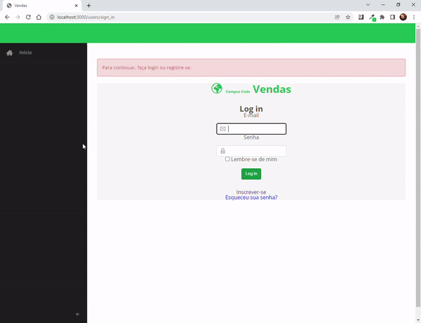

# Readme

<div align="center">
<h1 align="center"><span id="init"></span>
  Vendas
</h1>

<p align="center">
  <a href="#-sobre-o-projeto"> Sobre o Projeto </a>&nbsp;&nbsp;&nbsp;|&nbsp;&nbsp;&nbsp;
  <a href="#-tecnologias">Tecnologias</a>&nbsp;&nbsp;&nbsp;|&nbsp;&nbsp;&nbsp;
  <a href="#-projeto">Projeto</a>&nbsp;&nbsp;&nbsp;|&nbsp;&nbsp;&nbsp;
  <a href="#-api">API</a>&nbsp;&nbsp;&nbsp;|&nbsp;&nbsp;&nbsp;
  <a href="#%EF%B8%8F-cr%C3%A9ditos">Créditos</a>
</p>



</div>

## 💻 Sobre o Projeto

Esse é 1/4 do Projeto Final do treinamento Quero Ser Dev 7 e cobre o Módulo de Vendas.


<div align="right">
  <a href="#vendas" >[Voltar para o topo]</a>
</div>

## 🚀 Tecnologias

- Ruby
- Ruby on Rails
- sqlite3

<div align="right">
  <a href="#vendas" >[Voltar para o topo]</a>
</div>

## 🚀 Projeto

### Configurando o projeto

```
bin/setup
```

### Rodando o projeto

```
rails s
```

Para testar as diferentes funcionalidades, utilize os dados a seguir.

Testar como administrador no sistema:
```
E-mail: administrador@locaweb.com.br
Senha: 12345678
```

Testar como vendedor no sistema:
```
E-mail: vendedor@locaweb.com.br
Senha: 12345678
```

<div align="right">
  <a href="#vendas" >[Voltar para o topo]</a>
</div>

## 🔊 API

### Entendendo o status do pedido

O pedido pode estar nos estados `pending`, `concluded` ou `canceled`

- `pending`: Estado padrão de um pedido registrado no sistema. A única pendência do pedido é o pagamento.
- `concluded`: Estado que define que o pedido foi pago.
- `canceled`: Estado que define que houve cancelamento do pedido pelo time de vendas.

Essa API permite apenas a alteração do estado `pending` para `concluded` indicando o pagamento do pedido e de `concluded` para `pending` indicando estorno/corrreção de lançamento, caso venha a ser necessário. Outras alterações de estado são de uso interno desse Módulo de Vendas.

### Listar todos os pedidos de um cliente

**Requisição**

```
GET /api/v1/orders/clients/45994858021
```

**Resposta**

```
Status: 200 (OK)
[
  {
    "id":3,"plan_id":1,
    "cupom_id":null,
    "client_id":2,
    "user_id":2,
    "status":"pending",
    "value":"50.0",
    "period":"Mensal",
    "client_eni":"45994858021"
  },
  {
    "id":6,
    "plan_id":1,
    "cupom_id":null,
    "client_id":2,
    "user_id":2,
    "status":"pending",
    "value":"50.0",
    "period":"Mensal",
    "client_eni":"45994858021"
  }
]
```

### Listar um pedido

**Requisição**

```
GET /api/v1/orders/2
```

**Resposta**

```
Status: 200 (OK)

{
  "id":2,
  "plan_id":1,
  "cupom_id":null,
  "client_id":1,
  "user_id":3,
  "status":"pending",
  "value":"50.0",
  "period":"Mensal",
  "client_eni":"92817341090"
}

```

### Alterar status de um pedido

#### **Requisição para Concluído**

```
PATCH /api/v1/orders/1/concluded
```

**Resposta**

```
Status: 200 (OK)

{
  "status":"concluded",
  "id":1,
  "plan_id":1,
  "cupom_id":null,
  "client_id":1,
  "user_id":2,
  "value":"50.0",
  "period":"Mensal",
  "client_eni":"92817341090"
}
```

#### **Requisição para Pendente**

```
PATCH /api/v1/orders/1/pending
```

**Resposta**

```
Status: 200 (OK)

{
  "status":"pending",
  "id":1,
  "plan_id":1,
  "cupom_id":null,
  "client_id":1,
  "user_id":2,
  "value":"50.0",
  "period":"Mensal",
  "client_eni":"92817341090"
}
```

#### **Requisição para Cancelamento**

```
PATCH /api/v1/orders/1/canceled
```

**Resposta**

```
Status: 200 (OK)

{
  "status":"canceled",
  "id":1,
  "plan_id":1,
  "cupom_id":null,
  "client_id":1,
  "user_id":2,
  "value":"50.0",
  "period":"Mensal",
  "client_eni":"92817341090"
}
```

### Renovar um pedido

**Requisição**

```
POST /api/v1/orders/
```

**Parâmetros**

```
{
  "plan_id": "1",
  "value": "50.0",
  "period": "Mensal",
  "client_eni": "49773455092"
}

```

**Resposta**

```
Status: 201 (CREATED)

{
  "id":1,
  "plan_id":1,
  "cupom_id":null,
  "client_id":1,
  "user_id":null,
  "status":"pending",
  "value":"50.0",
  "period":"Mensal",
  "client_eni":"49773455092"
}

```

<div align="right">
  <a href="#vendas" >[Voltar para o topo]</a>
</div>

## 🧙‍♂️ Créditos

- Alex Ramos
- Caio Lizeo
- Leandro Mesquita Trombini
- Thais Jacóe Soares
- Yuri Nana Hummel

<div align="right">
  <a href="#vendas" >[Voltar para o topo]</a>
</div>
